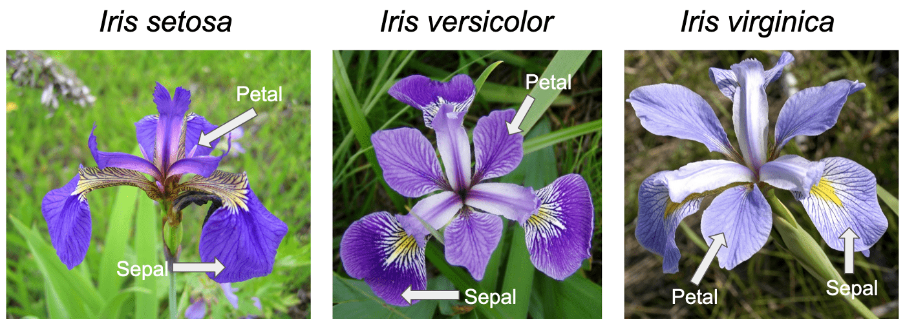
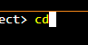
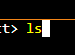
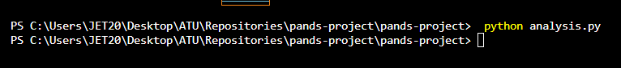
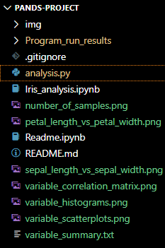

# Pands-Project
***
***

Author: Galal Abdelaziz

## [Fisher’s Iris data set](https://archive.ics.uci.edu/dataset/53/iris) analysis, conducted by __Galal Abdelaziz__, is part of the Programming and Scripting module in Summer 2023/2024, at [ATU](https://www.atu.ie/).

***
***

***
***

### Analysis

You can find the complete analysis [Here](Iris_analysis.ipynb); the following information is based on this analysis.

***
***

#### Summary:

The __Iris dataset__ is one of the most well-known and commonly used datasets in the field of machine learning and statistics. Here's an overview:

* The Iris dataset consists of __150 samples__ of iris flowers from three different species: [Setosa](https://en.wikipedia.org/wiki/Iris_setosa), [Versicolor](https://en.wikipedia.org/wiki/Iris_versicolor), and [Virginica](https://en.wikipedia.org/wiki/Iris_virginica).

* Each sample includes __four features__:

    * __Sepal length__: The length of the iris flower’s sepals (the green leaf-like structures that encase the flower bud).
    * __Sepal width__: The width of the iris flower’s sepals.
    * __Petal length__: The length of the iris flower’s petals (the colored structures of the flower).
    * __Petal width__: The width of the iris flower’s petals.

* Species in the Iris Dataset:

The target variable represents the species of the iris flower and has three classes:

* __Iris Setosa__: Characterized by its relatively small size, with distinctive characteristics in sepal and petal dimensions.
* __Iris Versicolor__: Moderate in size, with features falling between those of Iris setosa and Iris virginica.
* __Iris Virginica__: Generally larger in size, with notable differences in sepal and petal dimensions compared to the other two species.

* Notes:

    * The dataset was introduced by the British biologist and statistician [Ronald Fisher](https://en.wikipedia.org/wiki/Ronald_Fisher) in 1936 as an example of [discriminant analysis](https://en.wikipedia.org/wiki/Linear_discriminant_analysis).
    * Researchers and data scientists use the features of the iris flowers to classify each sample into one of the three species.
    * The dataset is particularly popular due to its __simplicity__ and the __clear separation__ of the different species based on the provided features.

* Historical Context:

    * The Iris dataset played a foundational role in statistical analysis and machine learning.
    * Ronald Fisher’s work on the dataset paved the way for the development of many classification algorithms still in use today.
    * It continues to be a benchmark for testing new machine learning models.

* Role in Machine Learning:

    * The Iris dataset serves as a standard benchmark for testing [classification algorithms](https://en.wikipedia.org/wiki/Statistical_classification#Algorithms).
    * Researchers use it to compare the performance of different algorithms and evaluate their accuracy, precision, and recall.

***

#### Variables: 

The Iris dataset contains two types of variables:

* Numeric Variables:

    * Sepal length.
    * Sepal width.
    * Petal length.
    * Petal width.

* Categorical Variable:
    * The only categorical variable in the dataset is the variety/species of iris flowers. It includes three classes:

        * Setosa.
        * Versicolor.
        * Virginica.

***

#### Analysis Key Findings:

* Distribution:

    * The data set have equal distribution between all three species (50 each).
    
* Species Separation:

    * The dataset exhibits clear separation between the three iris species: Setosa, Versicolor, and Virginica.
    * Visualizing the feature distributions (such as sepal length vs. sepal width or petal length vs. petal width) reveals distinct clusters for each species.

* Feature Importance:

    * Petal dimensions (length and width) play a crucial role in species differentiation.
    * Setosa has the smallest petals, while Virginica has the largest.
    * Sepal dimensions are less discriminative but still contribute to species classification.

* Scatter Plots:

    * Scatter plots of petal length vs. petal width show clear boundaries between species.
    * Setosa has the smallest petals, forming a tight cluster.
    * Versicolor and Virginica overlap more, but their petal dimensions still allow separation.

* Relationships:

     * The data analysis reveals strong correlations between the following:
    
         * Petal Width and Petal Length.
         * Petal Length and Sepal Length.
         * Petal Width and Sepal Length.
     * Aiding in species classification.

* Outlier Detection: 

    * Some outliers are present, potentially indicating unique or anomalous specimens within the dataset.

***
***

### References:

* The data set found [on GitHub](https://raw.githubusercontent.com/mwaskom/seaborn-data/master/iris.csv).
* Information about plotting found [on RealPython](https://realpython.com/python-matplotlib-guide/#understanding-pltsubplots-notation).
* Pandas guides on Pandas [1](https://pandas.pydata.org/docs/user_guide/index.html#user-guide), [2](https://pandas.pydata.org/docs/user_guide/dsintro.html#dataframe), [3](https://pandas.pydata.org/docs/user_guide/10min.html#plotting), [4](https://pandas.pydata.org/docs/reference/api/pandas.DataFrame.corr.html).
* Information about the data set found on [Wikipedia](https://en.wikipedia.org/wiki/Iris_flower_data_set), [GeeksforGeeks](https://www.geeksforgeeks.org/iris-dataset/), [ARCCA](https://arcca.github.io/An-Introduction-to-Machine-Learning-Applications/03-scikit-learn-iris-dataset/index.html), [Embedded Robotics](https://www.embedded-robotics.com/iris-dataset-classification/), [scikit-learn](https://scikit-learn.org/stable/auto_examples/datasets/plot_iris_dataset.html), [Towards Data Science](https://towardsdatascience.com/an-eda-walkthrough-the-iris-dataset-3f79246266c1).

***
***

### Libraries:

* [Pandas](https://pandas.pydata.org): Imported the pandas library for data manipulation.
* [Seaborn](https://seaborn.pydata.org): Imported the seaborn library for visualization.
* [Matplotlib.pyplot](https://matplotlib.org/stable/tutorials/pyplot.html): Imported the matplotlib library for visualization.
* [Warnings](https://docs.python.org/3/library/warnings.html): Imported the warnings library to suppress a warning message. 

***
***

### Technologies:

* Python 3.11.5 available [here](https://www.anaconda.com/download)
* Visual Studio Code available [here](https://code.visualstudio.com/)

***
***

### Running the program:

* Clone the repository or download the "analysis.py" file to your computer. (The dataset is preloaded via URL, so there's no need to download it separately.)

* Locate the "analysis.py" file in your terminal.

* Run this command "python analysis.py".

* Now you can view the analysis images and txt file.

***
***

### End